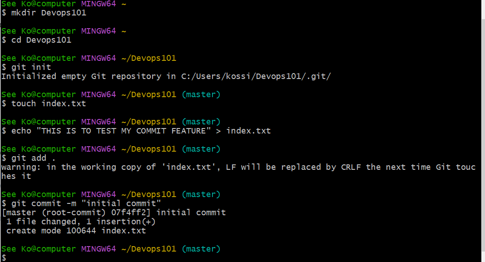
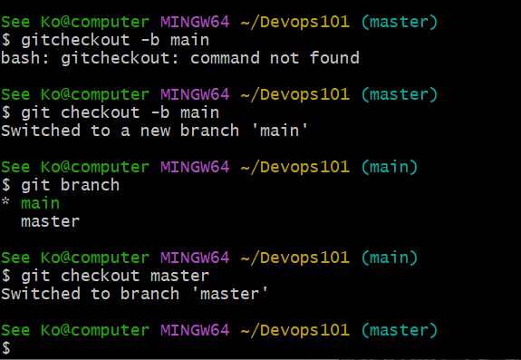
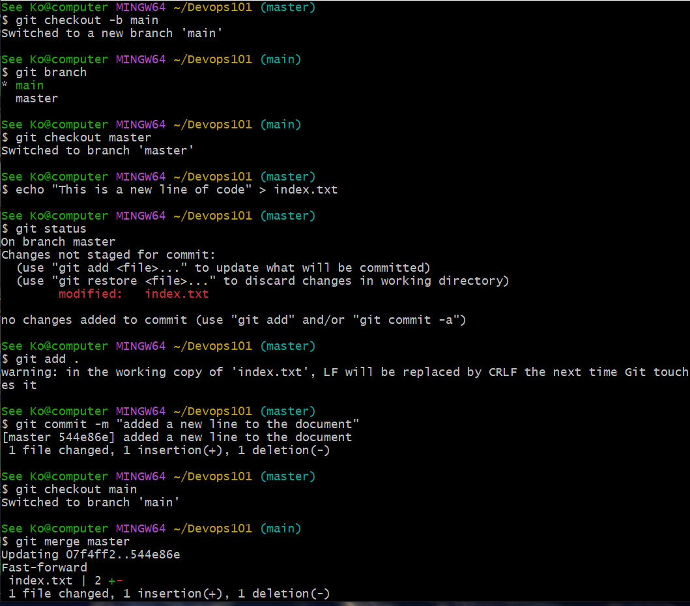
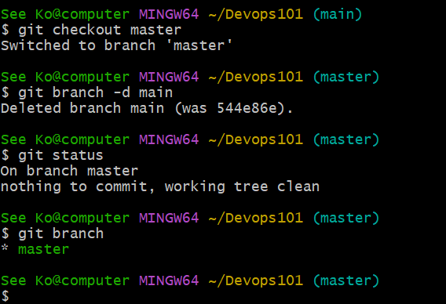
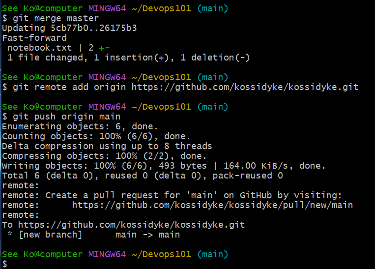
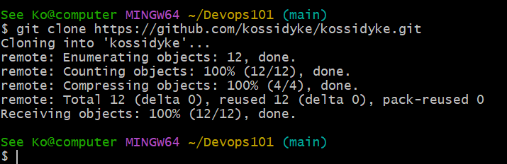

# GIT PROJECT: RUNNING SOME BASIC COMMANDS IN GITBASH

1) >INITIALIZING A GIT REPOSITORY: This command transforms the current directory into a git repository
    

2) > MAKING A COMMIT: This command simply means saving the changes you made to your files
    

3) > MAKING A BRANCH: The git branch commands primary functions are to create, list and delete branches
    

4) > MERGING A BRANCH: The git merge command is used to merge a development branch into the current branch
    

5) > DELETING A BRANCH: This command is run when a branch has served its purpose and needs to be removed
     

## PUSHING YOUR LOCAL REPOSITORY TO YOUR REMOTE GITHUB REPOSITORY
 
 6) > This command is used to add a remote repository to the remote repository
    > (git remote add origin <link>) (git push origin main)
     

 7) > CLONING REMOTE GIT REPOSITORY: The git clone command helps make a copy of remote repository in our local machine
     

